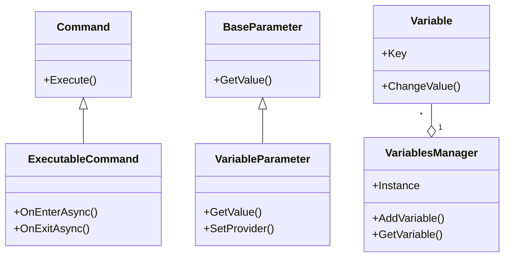

# Domain 模块

本模块是项目的核心领域模型，包含了系统的主要功能实现。

## 子模块

- **commands**: 命令系统相关类
  - **executables**: 可执行命令实现
  - **operators**: 运算符实现
- **parameter**: 参数相关类
  - **variable**: 变量参数
- **utils**: 工具类
- **variables**: 变量管理类

## 整体架构

Domain模块实现了一个基于命令模式的可视化编程系统，类似于Scratch的积木式编程。主要组件包括：

1. **命令系统**：提供各种可执行的命令，如控制流、事件、运动和变量操作等
2. **参数系统**：为命令提供参数支持，包括条件参数、下拉选择参数和变量参数等
3. **变量系统**：管理全局变量和局部变量
4. **工具类**：提供通用功能支持

## 类图

