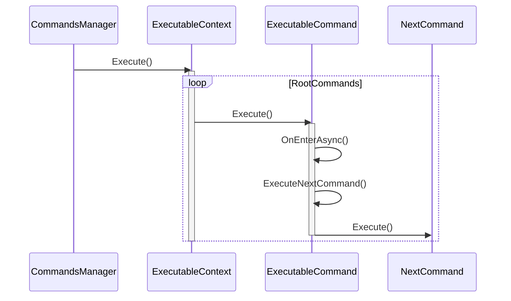

# Commands 模块说明

本模块是命令系统的核心实现，负责处理所有命令的基础结构和执行流程。

## 核心文件说明

### Command.cs
- 所有命令的抽象基类
- 提供基础的上下文管理和生命周期方法
- 定义了命令的基本接口和属性

### ExecutableCommand.cs
- 可执行命令的基类
- 实现了命令的链式执行机制
- 提供异步执行支持
- 包含克隆功能，用于复制命令结构

### Context.cs
- 命令执行的基础上下文
- 管理与GameObject的关联
- 提供基本的标识和引用功能

### ExecutableContext.cs
- 可执行命令的专用上下文
- 管理根命令列表
- 提供命令执行的生命周期控制
- 支持命令的克隆和取消操作

## 调度机制

## 子模块说明

### executables/
- 包含所有具体的可执行命令实现
- 分类包括：控制命令、事件命令、运动命令、变量操作命令等
- 每个命令都继承自ExecutableCommand，实现特定的功能

### operators/
- 包含各种运算符的实现
- 支持基本的算术运算、逻辑运算和比较运算
- 为条件判断和数值计算提供支持

## 命令执行流程

1. CommandsManager初始化ExecutableContext
2. 用户创建和组装命令链
3. 调用ExecutableContext.Execute()开始执行
4. 命令链按照设定的顺序异步执行
5. 支持通过CancellationToken取消执行

## 扩展说明

### 添加新命令
1. 继承ExecutableCommand类
2. 实现OnEnterAsync和OnExitAsync方法
3. 根据需要实现Clone方法
4. 在适当的分类目录下组织代码

### 命令链接
- 通过SetNextCommand方法设置下一个执行的命令
- 使用ExecuteNextCommand方法触发下一个命令的执行
- 支持条件分支和循环结构
