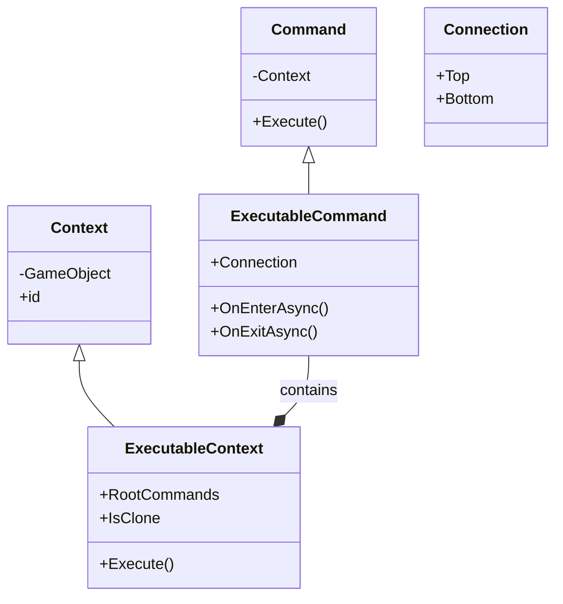

# Commands 模块

本模块包含与命令系统相关的基础类和接口。

## 文件说明

- **Command.cs**: 命令基类，定义了命令的基本结构和行为
- **Connection.cs**: 定义了命令之间的连接类型（枚举）
- **Context.cs**: 命令执行的上下文环境

## 子模块

- **executables**: 包含可执行命令的实现
  - **control**: 控制流命令（如循环、条件等）
  - **events**: 事件相关命令
  - **motion**: 运动相关命令
  - **variables**: 变量操作命令
- **operators**: 包含各种运算符的实现

## 类图

