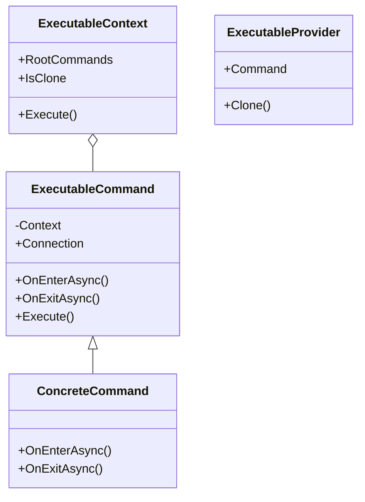

# Executables 模块

本模块包含可执行命令的基础类和具体实现。

## 文件说明

- **ExecutableCommand.cs**: 可执行命令的基类，定义了命令执行的生命周期方法
- **ExecutableContext.cs**: 可执行命令的上下文环境，包含命令执行的状态和控制
- **ExecutableProvider.cs**: 提供可执行命令的工厂类

## 子模块

- **control**: 控制流命令（如循环、条件、等待等）
- **events**: 事件相关命令（如点击、按键、消息等）
- **motion**: 运动相关命令（如移动、旋转等）
- **variables**: 变量操作命令（如设置、修改变量等）

## 类图

