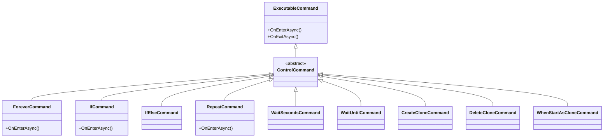

# Control 模块

本模块包含控制流相关的命令实现，用于控制程序的执行流程。

## 文件说明

- **CreateCloneCommand.cs**: 创建对象克隆的命令
- **DeleteCloneCommand.cs**: 删除克隆对象的命令
- **ForeverCommand.cs**: 无限循环执行命令
- **IfCommand.cs**: 条件判断命令
- **IfElseCommand.cs**: 条件分支命令
- **RepeatCommand.cs**: 重复执行命令指定次数
- **WaitSecondsCommand.cs**: 等待指定秒数
- **WaitUntilCommand.cs**: 等待直到条件满足
- **WhenStartAsCloneCommand.cs**: 当作为克隆启动时执行

## 类图

