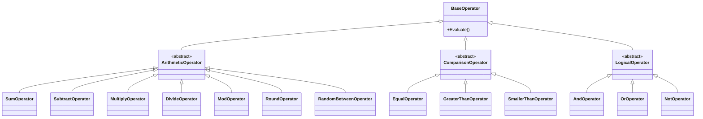

# Operators 模块

本模块包含各种运算符的实现，用于执行数学和逻辑运算。

## 文件说明

- **AndOperator.cs**: 逻辑与运算符
- **DivideOperator.cs**: 除法运算符
- **EqualOperator.cs**: 相等比较运算符
- **GreaterThanOperator.cs**: 大于比较运算符
- **ModOperator.cs**: 取模运算符
- **MultiplyOperator.cs**: 乘法运算符
- **NotOperator.cs**: 逻辑非运算符
- **OrOperator.cs**: 逻辑或运算符
- **RandomBetweenOperator.cs**: 随机数生成运算符
- **RoundOperator.cs**: 四舍五入运算符
- **SmallerThanOperator.cs**: 小于比较运算符
- **SubtractOperator.cs**: 减法运算符
- **SumOperator.cs**: 加法运算符

## 类图

