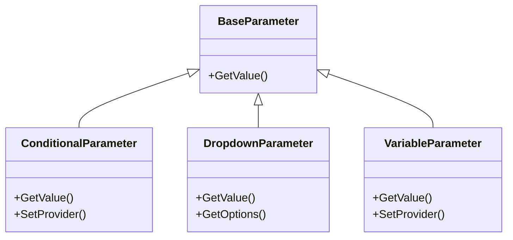

# Parameter 模块

本模块包含参数相关的类，用于处理命令执行时的参数。

## 文件说明

- **BaseParameter.cs**: 参数基类，定义了参数的基本结构和行为
- **ConditionalParameter.cs**: 条件参数，用于条件判断
- **DropdownParameter.cs**: 下拉选择参数，用于从预定义选项中选择

## 子模块

- **variable**: 变量参数相关类
  - **motion**: 运动相关的变量参数

## 类图

