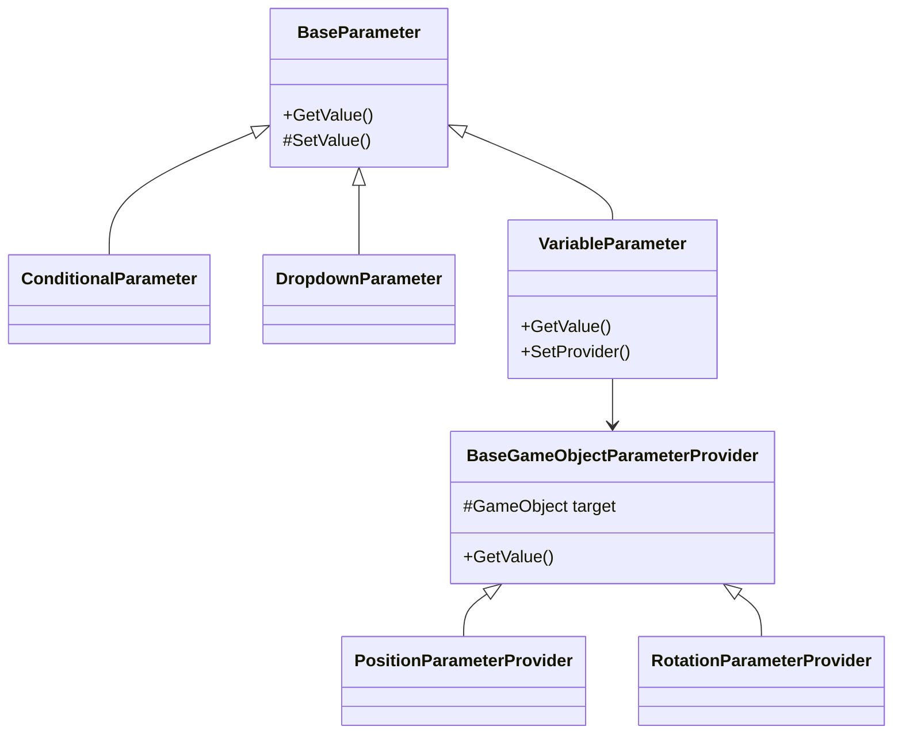

# Parameter 模块说明

本模块实现了命令系统中的参数处理机制，提供了各种类型的参数支持。

## 核心文件说明

### BaseParameter.cs
- 参数系统的基础抽象类
- 定义参数的基本行为和属性
- 提供值获取的统一接口

### ConditionalParameter.cs
- 条件参数的实现
- 用于处理逻辑判断条件
- 支持复杂的条件表达式

### DropdownParameter.cs
- 下拉选择参数的实现
- 提供选项列表功能
- 支持动态更新选项

## 子模块说明

### variable/
变量参数相关实现：
- VariableParameter.cs：变量参数的核心实现
- 提供变量值的动态获取和设置
- 支持与变量系统的双向绑定

#### motion/
运动相关参数实现：
- 位置参数（X/Y/Z）提供者
- 旋转参数（X/Y/Z）提供者
- 基于GameObject的参数获取机制

## 参数系统架构

## 参数处理流程

1. 参数初始化
   - 创建适当类型的参数实例
   - 设置参数提供者（如果需要）
   - 配置参数的初始值或绑定

2. 参数值获取
   - 通过GetValue方法获取参数值
   - 支持同步和异步获取
   - 处理参数值的类型转换

3. 参数更新
   - 通过SetValue方法更新参数值
   - 触发参数值变化的通知
   - 处理参数值的验证

## 扩展说明

### 添加新参数类型
1. 继承BaseParameter基类
2. 实现必要的参数处理方法
3. 根据需要添加特定的功能
4. 在适当的位置注册参数类型

### 创建参数提供者
1. 实现IParameterProvider接口
2. 定义值的获取和设置逻辑
3. 处理参数值的类型转换
4. 添加必要的验证和错误处理
