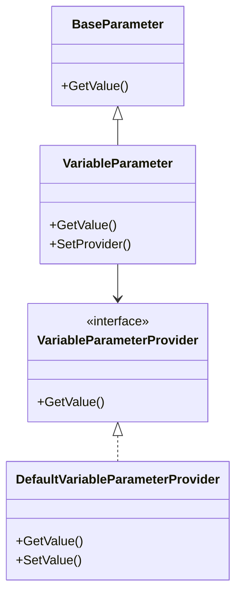

# Variable Parameter 模块

本模块包含变量参数相关的类，用于处理变量类型的参数。

## 文件说明

- **VariableParameter.cs**: 变量参数类，用于获取和设置变量的值

## 子模块

- **motion**: 运动相关的变量参数

## 类图

```mermaid
classDiagram
    BaseParameter <|-- VariableParameter
    VariableParameter --> VariableParameterProvider
    VariableParameterProvider <|.. DefaultVariableParameterProvider

    class BaseParameter {
        +GetValue()
    }

    class VariableParameter {
        +GetValue()
        +SetProvider()
    }

    class VariableParameterProvider {
        <<interface>>
        +GetValue()
    }

    class DefaultVariableParameterProvider {
        +GetValue()
        +SetValue()
    }
```
