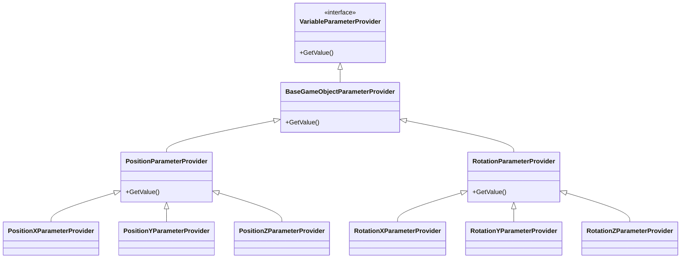

# Motion Variable Parameter 模块

本模块包含运动相关的变量参数类，用于获取和设置对象的位置和旋转信息。

## 文件说明

- **BaseGameObjectParameterProvider.cs**: 游戏对象参数提供者的基类
- **PositionXParameterProvider.cs**: X轴位置参数提供者
- **PositionYParameterProvider.cs**: Y轴位置参数提供者
- **PositionZParameterProvider.cs**: Z轴位置参数提供者
- **RotationXParameterProvider.cs**: X轴旋转参数提供者
- **RotationYParameterProvider.cs**: Y轴旋转参数提供者
- **RotationZParameterProvider.cs**: Z轴旋转参数提供者

## 类图

