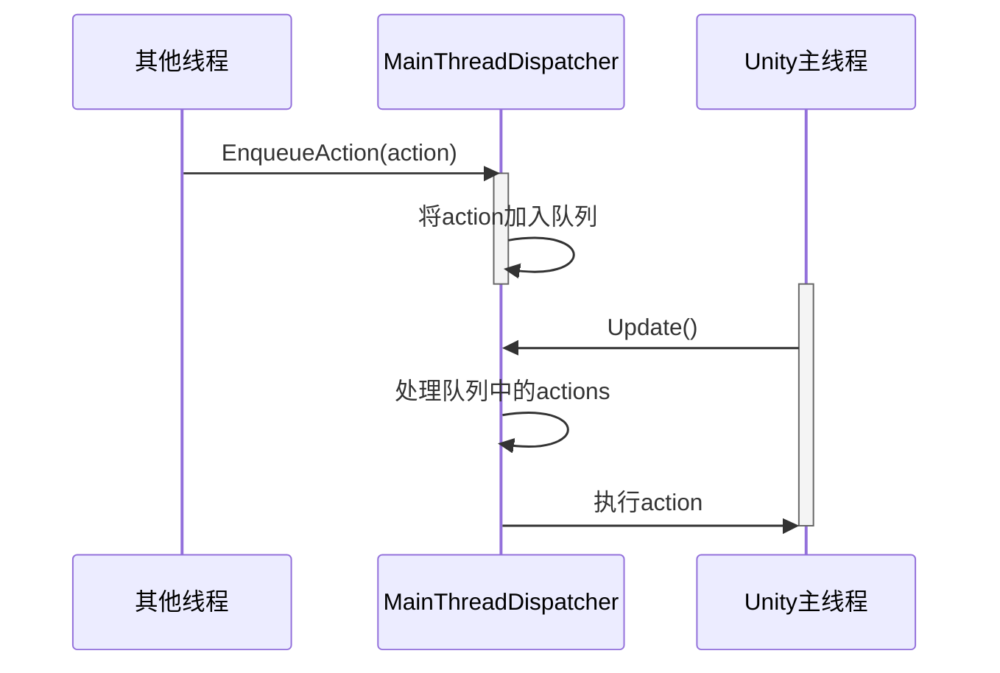

# Utils 模块说明

本模块提供了系统运行所需的各种工具类和辅助功能。

## 核心文件说明

### MainThreadDispatcher.cs
- Unity主线程调度器
- 管理需要在主线程执行的操作
- 使用队列机制确保操作按序执行
- 解决多线程环境下的Unity API调用问题



### UnityMethods.cs
- Unity生命周期事件管理器
- 提供全局Update事件订阅机制
- 统一管理Unity的生命周期回调
- 优化性能，避免多个MonoBehaviour的Update调用

## 功能说明

### 主线程调度
1. 解决问题
   - Unity API只能在主线程调用
   - 异步操作需要与主线程同步
   - 确保线程安全

2. 使用方式
   ```csharp
   MainThreadDispatcher.Instance.EnqueueAction(() => {
       // 需要在主线程执行的代码
   });
   ```

### 生命周期管理
1. 优势
   - 集中管理Update等事件
   - 减少MonoBehaviour实例数量
   - 提供统一的事件订阅接口

2. 使用方式
   ```csharp
   UnityMethods.Instance.UpdateEvent.AddListener(() => {
       // 需要在Update中执行的代码
   });
   ```

## 性能优化

1. 主线程调度优化
   - 使用队列批量处理操作
   - 避免频繁的线程切换
   - 合理控制队列大小

2. 事件系统优化
   - 统一的Update管理
   - 减少GameObject的Update开销
   - 支持动态订阅和取消订阅

## 注意事项

1. 线程安全
   - 确保Unity API调用在主线程执行
   - 注意避免死锁情况
   - 合理处理异常情况

2. 性能考虑
   - 控制入队操作的频率
   - 避免重复订阅事件
   - 及时清理不需要的事件监听
