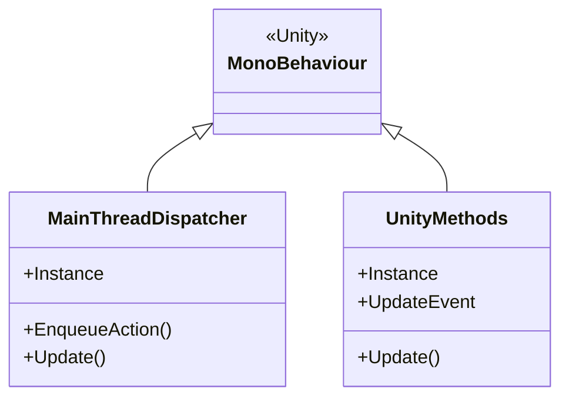

# Utils 模块

本模块包含工具类，提供通用的功能支持。

## 文件说明

- **MainThreadDispatcher.cs**: 主线程调度器，用于在主线程上执行操作
- **UnityMethods.cs**: Unity方法封装，提供Unity生命周期事件的访问

## 类图

```mermaid
classDiagram
    MonoBehaviour <|-- MainThreadDispatcher
    MonoBehaviour <|-- UnityMethods

    class MonoBehaviour {
        <<Unity>>
    }

    class MainThreadDispatcher {
        +Instance
        +EnqueueAction()
        +Update()
    }

    class UnityMethods {
        +Instance
        +UpdateEvent
        +Update()
    }
```
