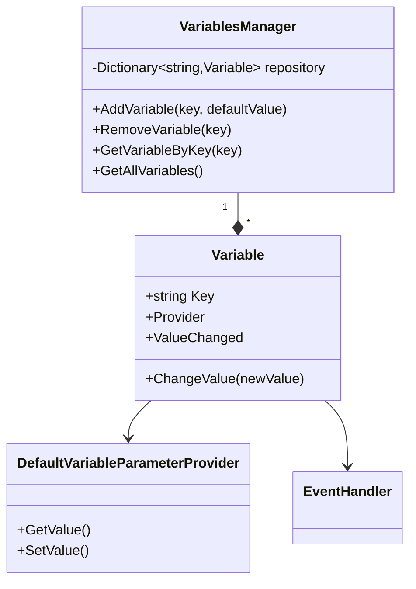
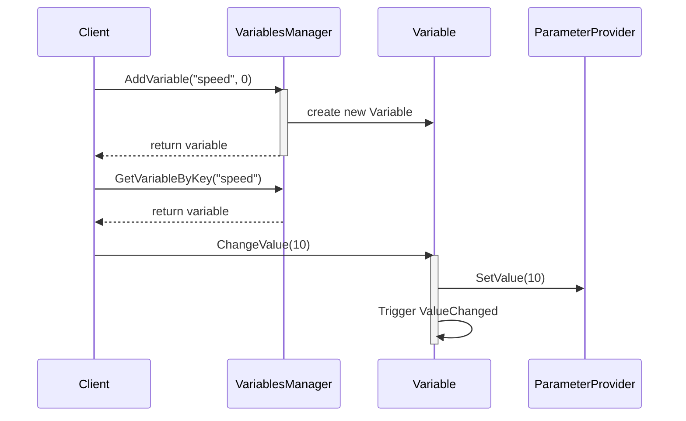

# Variables 模块说明

本模块实现了可视化编程系统中的变量管理功能，提供全局变量的创建、存储和访问机制。

## 核心文件说明

### Variable.cs
- 变量的核心实现类
- 管理变量的值和状态
- 提供值变化的事件通知
- 支持参数提供者机制

### VariablesManager.cs
- 全局变量管理器（单例模式）
- 提供变量的增删改查功能
- 维护变量仓库
- 提供变量更新事件通知

## 系统架构

## 功能说明

### 变量管理
1. 变量创建
   - 支持指定变量名
   - 设置默认值
   - 自动注册到管理器

2. 变量访问
   - 通过key获取变量
   - 支持获取所有变量
   - 值变化通知机制

3. 变量更新
   - 支持动态更新值
   - 触发值变化事件
   - 自动通知观察者

## 使用流程

## 变量系统特点

1. 统一管理
   - 集中存储所有变量
   - 保证变量名唯一性
   - 便于全局访问和管理

2. 类型安全
   - 支持类型检查
   - 避免类型转换错误
   - 提供类型安全的访问方式

3. 事件通知
   - 值变化事件
   - 变量列表更新事件
   - 支持多观察者模式

4. 扩展性
   - 支持自定义参数提供者
   - 可扩展变量类型
   - 灵活的事件机制

## 注意事项

1. 线程安全
   - 在多线程环境下注意同步
   - 避免并发修改问题
   - 合理使用锁机制

2. 性能考虑
   - 控制变量数量
   - 及时移除不需要的变量
   - 避免频繁的值变化通知

3. 使用建议
   - 合理命名变量
   - 注意变量生命周期
   - 及时清理事件监听
