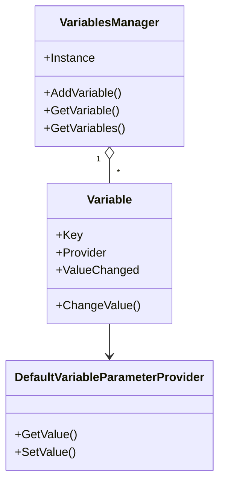

# Variables 模块

本模块包含变量管理相关的类，用于创建、存储和管理变量。

## 文件说明

- **Variable.cs**: 变量类，表示一个具名的变量及其值
- **VariablesManager.cs**: 变量管理器，负责变量的创建、获取和管理

## 类图

```mermaid
classDiagram
    VariablesManager "1" o-- "*" Variable
    Variable --> DefaultVariableParameterProvider

    class VariablesManager {
        +Instance
        +AddVariable()
        +GetVariable()
        +GetVariables()
    }

    class Variable {
        +Key
        +Provider
        +ValueChanged
        +ChangeValue()
    }

    class DefaultVariableParameterProvider {
        +GetValue()
        +SetValue()
    }
```
