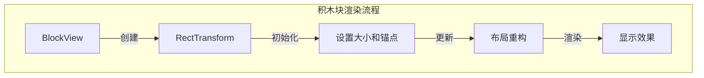
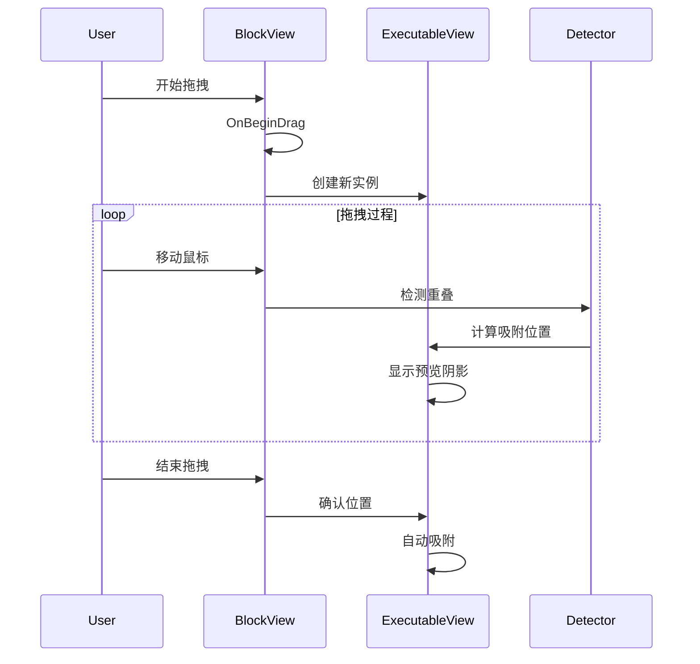
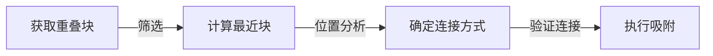
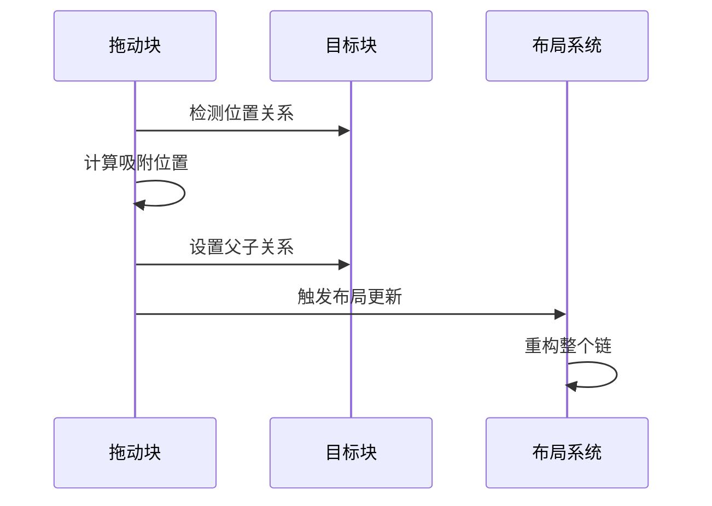

# View 模块说明

本模块实现了可视化编程系统的用户界面部分，包括积木块的渲染、拖拽、自动吸附等核心功能。

## 核心文件说明

### BlockView.cs
基础积木块视图类，实现了：
- 拖拽功能（IBeginDragHandler, IDragHandler, IEndDragHandler）
- 碰撞检测
- 布局重构
- 克隆创建功能

### CommandsManager.cs
命令管理器，负责：
- 管理所有命令块
- 处理编辑/游戏模式切换
- 执行命令序列
- 重置目标对象状态

### ExecutableView.cs
可执行积木块的基类，实现：
- 积木块的连接机制
- 自动吸附功能
- 命令链管理
- 阴影预览效果

### ExecutableSocket.cs
积木块接口实现，处理：
- 积木块的连接点
- 位置计算和更新
- 连接状态管理
- 布局更新

## 渲染机制

## 拖拽系统

## 自动吸附机制

### 1. 检测流程

1. 重叠检测
   - 使用RectTransform.GetWorldCorners获取角点
   - 计算重叠区域
   - 过滤无效重叠

2. 位置计算
   - 确定上下关系
   - 计算吸附偏移
   - 调整相对位置

3. 连接验证
   - 检查连接类型
   - 验证已有连接
   - 确保合法性

### 2. 吸附实现

## 目录结构说明

### executable/
可执行块相关实现：
- commands/: 各类命令块的视图实现
  - control/: 控制类命令（if/循环等）
  - events/: 事件类命令
  - motion/: 运动类命令
  - variables/: 变量操作命令

### parameter/
参数系统视图实现：
- conditional/: 条件参数相关
- variable/: 变量参数相关
- ParameterView.cs: 参数基类
- DropdownView.cs: 下拉选择实现

## 性能优化

1. 布局优化
   - 使用LayoutRebuilder控制刷新时机
   - 避免不必要的布局重构
   - 批量处理布局更新

2. 渲染优化
   - 使用对象池管理预览阴影
   - 控制重绘频率
   - 优化碰撞检测

## 扩展说明

### 添加新积木类型
1. 继承ExecutableView
2. 实现必要的重写方法
3. 设置正确的连接类型
4. 注册到CommandsManager

### 自定义连接行为
1. 重写相关检测方法
2. 实现自定义吸附规则
3. 处理特殊布局需求
