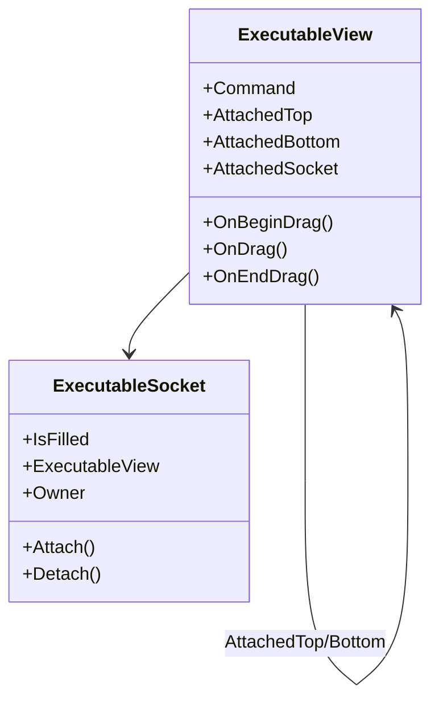
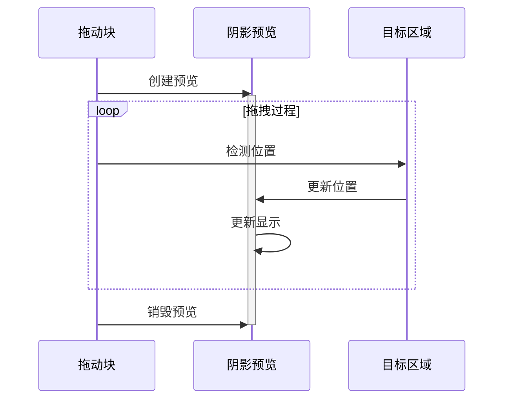

# Executable 模块说明

本模块实现了可执行积木块的视图层，负责处理积木块的显示、交互和连接逻辑。

## 核心文件说明

### ExecutableView.cs
- 可执行块的基类
- 实现积木块的连接逻辑
- 管理子积木块之间的关系
- 处理拖拽和吸附行为

### ExecutableSocket.cs
- 积木块连接点的实现
- 处理积木块的对接机制
- 管理连接状态和布局
- 提供事件通知机制

## 命令视图实现

### control/
控制类命令的视图实现：
- ForeverCommandView: 循环执行
- IfCommandView: 条件判断
- IfElseCommandView: 条件分支
- RepeatCommandView: 重复执行
- WaitCommandView: 等待命令
- CreateCloneCommandView: 克隆创建
- DeleteCloneCommandView: 克隆删除

### events/
事件类命令的视图实现：
- ClickEventView: 点击事件
- KeyPressedEventView: 按键事件
- MessageEventView: 消息事件
- WhenConditionEventView: 条件触发

### motion/
运动类命令的视图实现：
- MoveByVectorView: 相对移动
- MoveToVectorView: 绝对移动
- RotateByVectorView: 相对旋转
- RotateToVectorView: 绝对旋转

### variables/
变量操作命令的视图实现：
- ChangeVariableByCommandView: 变量增减
- SetVariableToCommandView: 变量赋值

## 连接机制实现

### 连接类型
1. 顶部连接
   - 通过AttachedTop属性管理
   - 自动更新命令链关系
   - 维护视觉连接效果

2. 底部连接
   - 通过AttachedBottom属性管理
   - 处理子命令的布局
   - 实现命令链的延续

3. Socket连接
   - 适用于条件、循环等命令
   - 管理内部命令块
   - 处理特殊布局需求

## 拖拽预览实现

## 布局管理

1. 基础布局
   - 使用Unity UI的RectTransform
   - 自动计算大小和位置
   - 处理父子关系变化

2. 动态更新
   - 监听内容变化
   - 递归更新布局
   - 优化刷新性能

## 事件系统

1. 拖拽事件
   - OnBeginDrag: 开始拖拽
   - OnDrag: 拖拽中
   - OnEndDrag: 结束拖拽

2. 连接事件
   - OnAttached: 连接建立
   - OnDetached: 连接断开
   - OnLayoutUpdated: 布局更新

## 注意事项

1. 性能优化
   - 合理使用预览机制
   - 避免频繁的布局计算
   - 优化碰撞检测逻辑

2. 扩展开发
   - 遵循命名规范
   - 正确设置连接属性
   - 处理特殊交互需求
