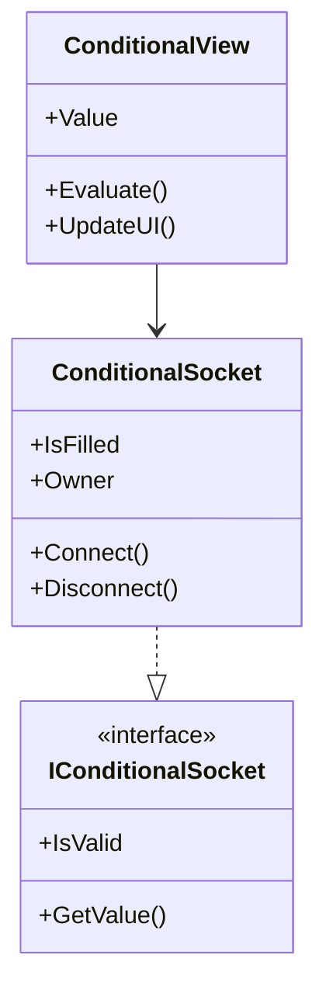
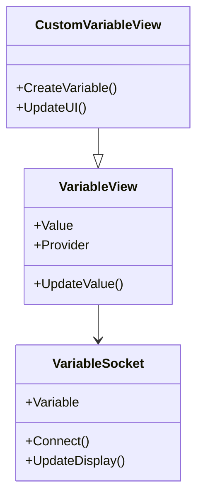
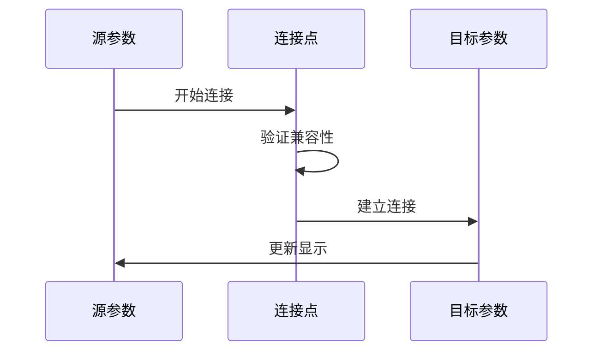
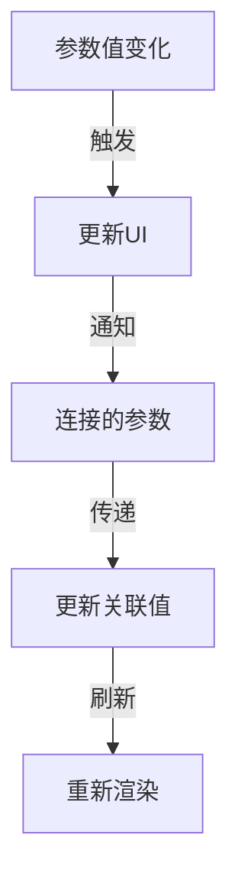

# Parameter 视图模块说明

本模块实现了参数系统的视图层，负责处理各种参数的显示和交互逻辑。

## 核心文件说明

### ParameterView.cs
- 参数视图的基类
- 处理参数的基础渲染
- 提供参数值更新机制
- 管理参数UI交互

### DropdownView.cs
- 下拉选择框的实现
- 管理选项列表
- 处理选择事件
- 提供动态更新机制

### ISocketBlock.cs
- 参数接口的声明
- 定义参数交互规范
- 提供统一的连接机制

## 子模块说明

### conditional/
条件参数相关实现：

1. 操作符视图
   - AndOperatorView: 与运算
   - OrOperatorView: 或运算
   - NotOperatorView: 非运算
   - ComparisonOperatorViews: 比较运算

2. 连接机制
   - ConditionalSocket: 条件连接点
   - 支持条件组合
   - 处理条件嵌套

### variable/
变量参数相关实现：

1. 基础组件
   - VariableView: 变量显示
   - VariableSocket: 变量连接点
   - CustomVariableView: 自定义变量

2. 运算符视图
   - 算术运算符
   - 数学函数
   - 随机数生成

3. motion/
运动参数相关实现：
   - 位置参数（X/Y/Z）
   - 旋转参数（X/Y/Z）
   - 基于GameObject的参数提供

## 参数连接机制

### 1. Socket系统

1. 连接建立
   - 类型检查
   - 值传递机制
   - 更新通知

2. 连接管理
   - 状态跟踪
   - 断开处理
   - 清理机制

### 2. 值更新流程

## 交互设计

1. 拖拽交互
   - 支持拖拽连接
   - 自动对齐
   - 类型匹配检查

2. 输入处理
   - 直接输入支持
   - 数值验证
   - 格式化显示

3. 视觉反馈
   - 连接状态提示
   - 错误显示
   - 高亮效果

## 扩展开发

### 添加新参数类型
1. 继承ParameterView
2. 实现值处理逻辑
3. 设计UI交互
4. 处理连接机制

### 自定义参数行为
1. 实现ISocketBlock接口
2. 定义特定的连接规则
3. 设计参数验证逻辑

## 注意事项

1. 性能考虑
   - 减少不必要的更新
   - 优化值传递机制
   - 合理使用缓存

2. 使用建议
   - 正确处理连接生命周期
   - 及时清理无效连接
   - 注意类型安全
