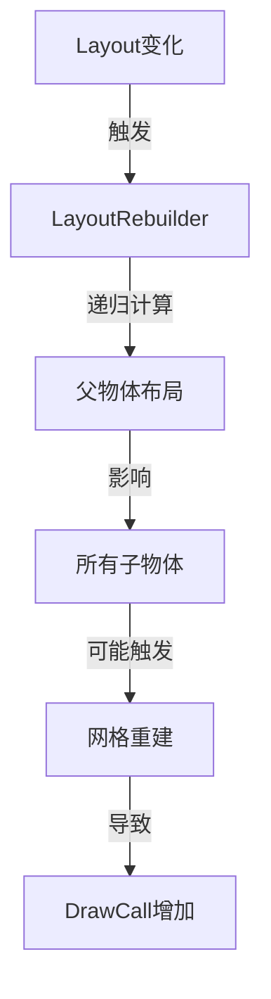
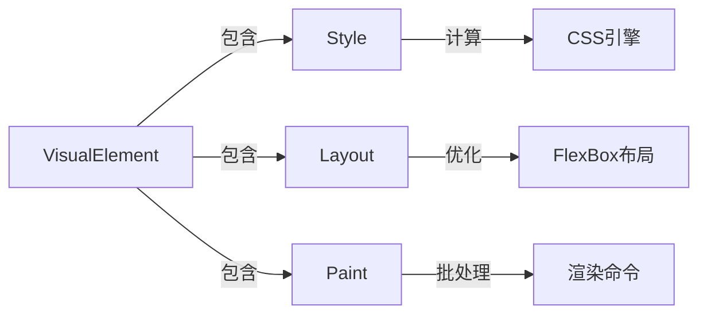
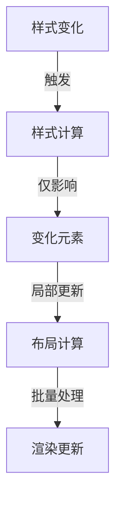
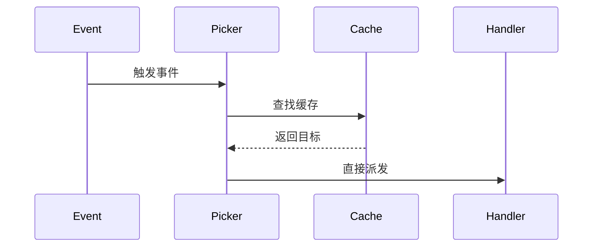

# UGUI vs UI Toolkit 性能分析

## UGUI的性能开销

### 1. GameObject开销
```
每个UI元素 = 1个GameObject + 多个Component
- Transform
- RectTransform
- CanvasRenderer
- 具体UI组件（Image/Text等）
```

**内存开销：**
- 每个GameObject：约1KB
- RectTransform：约256字节
- CanvasRenderer：约128字节
- 组件引用和其他开销：约512字节
- 总计：每个UI元素约2KB基础开销

### 2. 布局重计算


**性能问题：**
1. 层级遍历
   - 每次布局更改都需要遍历层级
   - 父节点变化会影响所有子节点
   - 复杂布局导致性能下降

2. 网格重建
   - 频繁的布局变化导致网格重建
   - 每次重建都需要CPU计算
   - 增加内存垃圾回收压力

### 3. 事件系统
```
EventSystem -> GraphicRaycaster -> 射线检测 -> 事件分发
```
- 使用物理射线检测
- 需要遍历所有UI元素
- 事件冒泡开销大

## UI Toolkit的优化方案

### 1. 轻量级对象模型


**优势：**
- 无GameObject开销
- 纯C#对象，更少的内存占用
- 更快的实例化和销毁

### 2. 现代布局系统


**优化点：**
1. FlexBox布局
   - 更高效的布局算法
   - 更少的重计算次数
   - 更好的性能可预测性

2. 样式计算
   - CSS样式引擎
   - 增量更新
   - 样式继承优化

### 3. 渲染优化
```csharp
// UI Toolkit渲染批处理示例
class RenderBatch
{
    List<VisualElement> elements;
    Matrix4x4 transformMatrix;
    // 单个批次处理多个元素
    void ProcessBatch()
    {
        // 合并渲染命令
        // 减少DrawCall
    }
}
```

**优势：**
1. 批处理渲染
   - 自动合并相似元素
   - 减少DrawCall数量
   - 更好的GPU利用

2. 命令缓冲
   - 渲染命令缓存
   - 减少CPU开销
   - 更高效的状态切换

### 4. 事件系统优化


**改进：**
- 使用空间分区优化
- 事件处理器缓存
- 更高效的事件分发

## 性能对比数据

### 1. 内存占用（1000个UI元素）
```
UGUI:        ~2MB + 1000个GameObject
UI Toolkit:  ~500KB（纯C#对象）
```

### 2. 实例化时间
```
UGUI:        ~5ms/100个元素
UI Toolkit:  ~1ms/100个元素
```

### 3. 布局重计算
```
UGUI:        O(n * m) n=元素数量，m=层级深度
UI Toolkit:  O(n) 扁平化处理
```

## 最佳实践建议

### 1. 使用UI Toolkit的场景
- 大量动态UI元素
- 频繁的布局变化
- 需要复杂样式管理
- 需要响应式设计

### 2. 性能优化策略
```csharp
// UI Toolkit优化示例
public class OptimizedUIBlock : VisualElement
{
    // 使用样式类而不是内联样式
    public OptimizedUIBlock()
    {
        this.AddToClassList("optimized-block");
        // 避免频繁样式修改
    }
    
    // 批量更新
    public void UpdateContent()
    {
        this.EnableInClassList("updated", true);
        // 一次性应用多个更改
    }
}
```

1. 样式优化
   - 使用CSS类而不是内联样式
   - 避免频繁的样式修改
   - 利用CSS继承减少重复定义

2. 布局优化
   - 控制视图层级深度
   - 使用虚拟化列表
   - 延迟加载非关键UI

3. 渲染优化
   - 合理使用不透明度
   - 避免过度的视觉效果
   - 正确管理UI更新时机

## 结论

UI Toolkit相比UGUI具有显著的性能优势：
1. 更低的内存开销（无GameObject）
2. 更快的实例化和销毁
3. 更高效的布局系统
4. 更好的批处理渲染
5. 更现代的开发方式

这些优势在处理大量动态UI元素时特别明显，使其成为复杂UI系统的更好选择。
