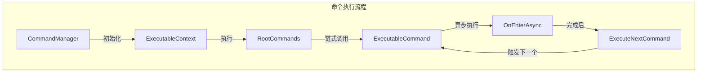
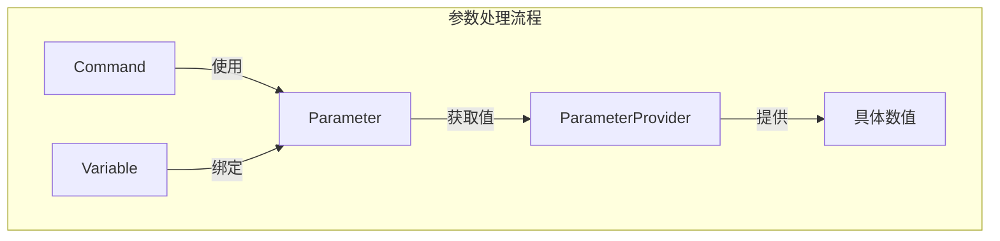
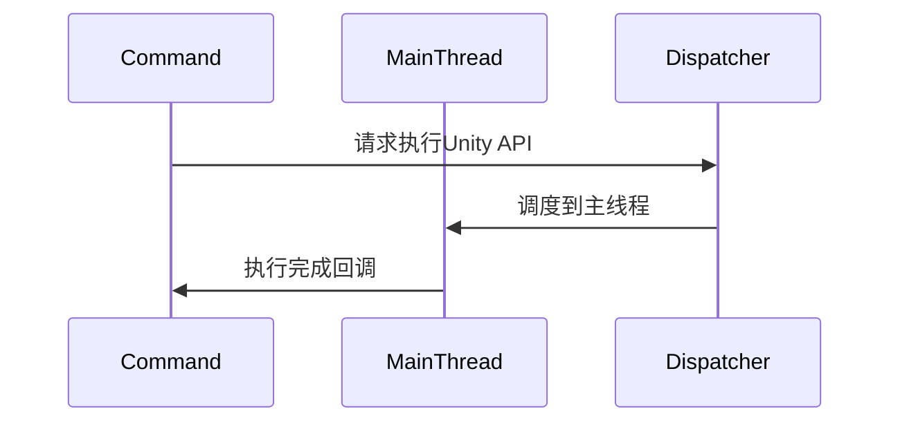
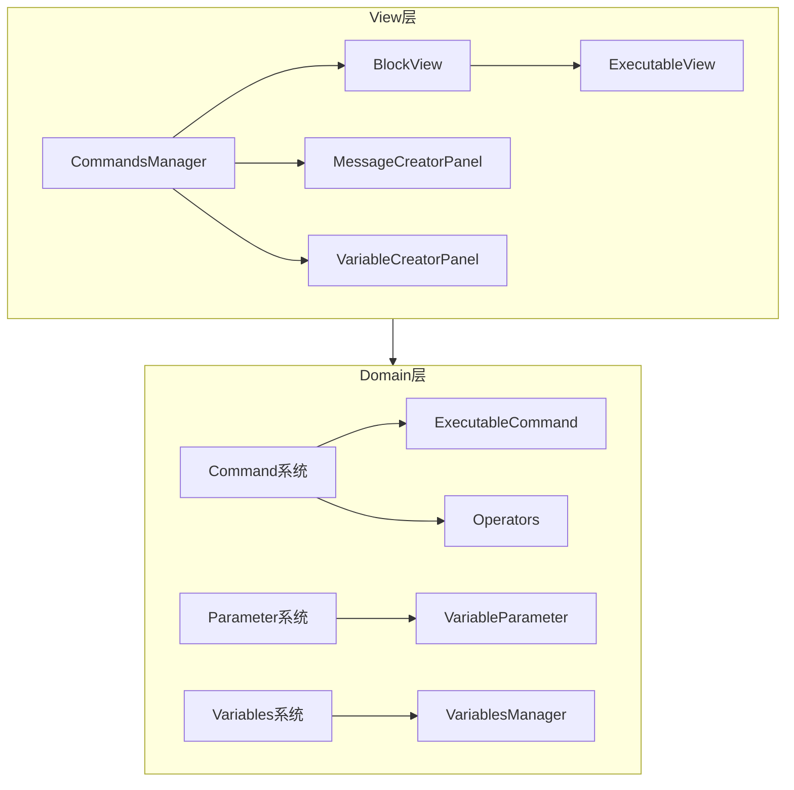
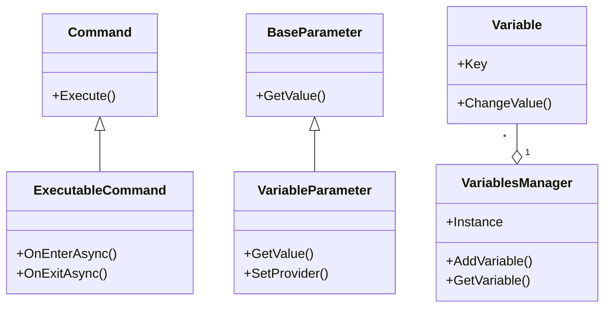
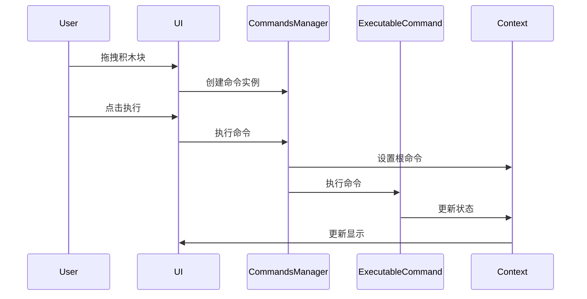

# UnityScratch

一个基于Unity实现的Scratch可视化编程克隆项目，支持运行时块式可视化编程。

## 项目简介

UnityScratch是一个使用Unity开发的可视化编程平台，模仿了Scratch的积木式编程方式，让用户可以通过拖拽积木块的方式创建程序逻辑。该项目致力于为Unity开发者提供一个简单易用的可视化编程解决方案。

## 节点调度机制

系统通过多层架构实现了灵活的节点调度：

1. **命令调度**


2. **事件系统**
- EventCommand处理各类事件触发
- 支持点击、按键、消息广播等事件
- 使用观察者模式实现事件分发

3. **参数系统**


4. **变量管理**
- VariablesManager统一管理全局变量
- 支持变量的动态创建和更新
- 提供事件通知机制

5. **线程调度**


主要特点：
- 基于异步的命令执行
- 事件驱动的交互系统
- 统一的参数处理机制
- 线程安全的调度机制

## 系统架构

项目采用了清晰的分层架构设计，主要分为以下几个核心部分：



### 核心模块说明

#### 1. Domain模块
Domain模块是项目的核心领域模型，实现了系统的主要功能：



包含以下子模块：
- **commands**: 命令系统相关类
  - executables: 可执行命令实现
  - operators: 运算符实现
- **parameter**: 参数相关类
  - variable: 变量参数
- **variables**: 变量管理类
- **utils**: 工具类

#### 2. View模块
负责UI交互和可视化展示，主要包括：
- BlockView: 积木块的基类，处理拖拽等交互
- CommandsManager: 管理所有命令块，处理执行逻辑
- MessageCreatorPanel: 消息创建面板
- VariableCreatorPanel: 变量创建面板

### 技术特点

1. **积木块系统**
- 支持拖拽创建
- 块间自动吸附
- 支持嵌套组合
- 实时预览效果

2. **命令执行系统**
- 基于命令模式设计
- 支持异步执行
- 提供执行上下文
- 可扩展的命令集

3. **参数系统**
- 支持多种参数类型
- 变量参数动态绑定
- 条件参数评估
- 支持自定义参数

4. **变量管理**
- 全局变量支持
- 局部变量域
- 动态创建和管理
- 类型安全

## 使用方式

1. **编辑模式**
- 从左侧命令面板拖拽所需的积木块
- 通过拖拽组合各个积木块
- 设置所需的参数和变量
- 创建完整的逻辑流程

2. **执行模式**
- 点击运行按钮执行程序
- 实时查看执行效果
- 可随时停止执行
- 支持重置场景

## 系统交互流程



## 开发说明

1. **项目结构**
```
Assets/
├── Scripts/
│   ├── domain/         # 核心领域模型
│   │   ├── commands/   # 命令系统
│   │   ├── parameter/  # 参数系统
│   │   └── variables/  # 变量系统
│   └── view/          # UI视图层
├── Prefabs/           # 预制体
├── Scenes/            # 场景文件
└── Resources/         # 资源文件
```

2. **扩展开发**
- 添加新命令：继承ExecutableCommand类
- 自定义参数：继承BaseParameter类
- 创建新积木：继承BlockView类

## 注意事项

1. 运行环境
- Unity 2020.3或更高版本
- 需要TextMesh Pro插件
- 依赖DOTween插件

2. 性能考虑
- 大量嵌套命令可能影响性能
- 建议控制单个积木链的复杂度
- 注意变量的作用域管理

## 项目展示

<p align="center">
  
</p>
